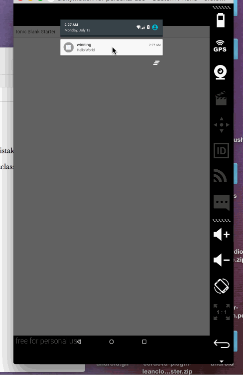
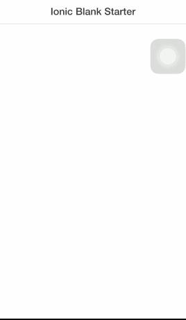
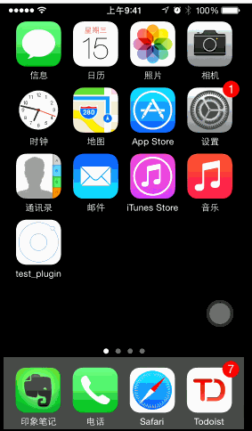
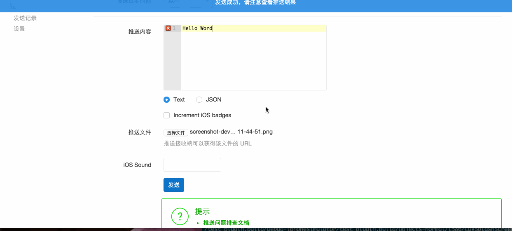

cordova-plugin-leanpush
========================

Cordova plugin for [LeanCloud](https://leancloud.cn) push notification


## Installation


- Fetch from cordova npm

```shell
 cordova plugin add cordova-plugin-leanpush  --variable LEAN_APP_ID=<YOUR_LEANCOULD_APP_ID> --variable LEAN_APP_KEY=<YOUR_LEANCOULD_APP_KEY>
```


- Add this to your `gulpfile.js`

```js
gulp.task('lpush-install', function(done){
    require('./plugins/cordova-plugin-leanpush/lpush-installer.js')(__dirname, done);
});
```

- `npm install --save-dev xml2js && npm install`

- Then exectue this gulp task by running `gulp lpush-install` in shell.

- Done.

### Known Android Build Issue

See [Attention/Android Build Issue](#android-build-issue)

### TODO

- ADD Push Notification History

 > 这个是很重要的， 比如在APP中， 不同的项目展示badge数目（有无新的通知）。 这个badge数由那些最新的push消息来计算，最为合理。 但是这个插件现在只能拿到一个push结果（用户点击的那个）。  如果不用push来计算badge，就挺麻烦的


## Usage

### Init


Put the initialization Code in your "deviceReady" Code Block (like $ionicPlatform.ready)

```js
window.LeanPush.init();
```

<!-- The Init accepts a optional function as the callback when the notification recieves *(If provided, it will call onNotificationReceived on this function)*. -->


### Push Related API


Coresponding to the [Leancloud Push documentation](https://leancloud.cn/docs/ios_push_guide.html).

```js

window.LeanPush.subscribe(channel, success, error)  // 订阅频道
window.LeanPush.unsubscribe(channel, success, error) //退订频道
window.LeanPush.clearSubscription(success, error) //退订所有频道

window.LeanPush.getInstallation(success, error)  //Installation 表示一个允许推送的设备的唯一标示, 对应数据管理平台中的 _Installation 表
// success callback:
// function(data){
//   data = {
//        'deviceType':'android' or 'ios',
//        'installationId': 'android installation id' or 'ios deviceToken'
//        'deviceToken':    'ios deviceToken' or 'android installation id'
//   }
// }


window.LeanPush.onNotificationReceived(callback) // 一个notification到来的回调函数
// callback:
// function(notice){
//  notice = {
//     'prevAppState': 'background' or 'foreground' or 'closed',

//      push到来的时候上一个App状态:
//      android只有 'background' 和 'closed', 因为android所有push都要点击
//      ios都有，因为ios如果app在前台，系统推送的alert不会出现
//      用户没有任何操作，app就自动执行notification的函数不好, 可以加个判断

//     'alert':'Notice Text',
//     'file_url':'Push File',
//     'key':'value'   if you send JSON Type Push, they will map to here.
//   }
// }
    

$rootScope.$on('leancloud:notificationReceived', callback) // 如果你用了angular， 一个notification会在scope上broadcast这个event
// callback:
// function(event, notice){
//    // event is from angular, notice is same above 
// }
```

Many Thanks to [Derek Hsu](https://github.com/Hybrid-Force) XD 😁


### About Sending Push

Use the [JS API: AV.Push](https://leancloud.cn/docs/js_guide.html#Push_通知) that leancloud provide.


### LeanAnalytics API

Corresponding code is forked from [https://github.com/Hybrid-Force/cordova-plugin-leancloud](https://github.com/Hybrid-Force/cordova-plugin-leancloud).


Only a novice for leancloud I am, so

- take a look at the source code [https://github.com/BenBBear/cordova-plugin-leanpush/blob/master/www/LeanAnalytics.js](https://github.com/BenBBear/cordova-plugin-leanpush/blob/master/www/LeanAnalytics.js) to know the API

- and study the [Leancloud documentation about leanAnalytics](https://leancloud.cn/docs/ios_statistics.html)

is the better way to go.


---

## Screen Recording

### Android


### IOS

See the [Attention Below](#attention), the webview can't `alert` when `onResume`

#### One

- notice from close
- notice while foreground



#### Two

- notice from background

##### mobile



##### console.log



The debugger in screenshot is [GapDebug](https://www.genuitec.com/products/gapdebug/), debug phonegap in browser :D


## Behavior

The `onNotificationReceived callback`  and the `$rootScope.$emit('leancloud:notificationReceived')` will fires when

### IOS

- app in the foreground, notice comes (won't show the system notification alert)
- app in the background, tap the notification to resume it
- app closed, tap the notification to open it

### Android


- app in the foreground, tap the notification to see it
- app in the background, tap the notification to resume it
- app closed, tap the notification to open it


## Attention

### Android Quirk

In order to receive push from android, I change the default `MainActivity` and `Application Entry`  in that gulp task. Details in the [lpush_installer.js](https://github.com/BenBBear/cordova-plugin-leanpush/blob/master/lpush-installer.js).

> So if you use another plugin that also goes this way, then there gonna be conflicts.


#### Uninstall

For fully uninstallation:

```shell
cordova plugin rm cordova-plugin-leanpush
ionic platform rm android && ionic platform rm ios
ionic platform add android && ionic platform add ios
```

### Don't Use Alert in the IOS inside Notification Callback

> `alert` is a blocking function.

#### IOS UIWebView

It will cause the app to freeze when you resume the app by clicking notification. (but it seems ok when the app is in the foreground or closed.)

###  For Android

As far as I try, `alert` is fine, guess is the difference of webView between  IOS and android.


### Notification Handler

There are two ways, both will be fired when notification comes

- `onNotificationReceived`

- `$rootScope.$emit('leancloud:notificationReceived')`


You can choose one of them, but may not both.


###  Android Build Issue

- **Error: duplicate files during packaging of APK**

**How to Solve:**


insert following code into the **android tag** of `platforms/android/build.gradle`

```groovy
 packagingOptions {
       exclude 'META-INF/LICENSE.txt'
 	   exclude 'META-INF/NOTICE.txt'
}
```

It should look like below

```groovy
android{
   packagingOptions {
       exclude 'META-INF/LICENSE.txt'
 	   exclude 'META-INF/NOTICE.txt'
   }
    //stuff
}
```


## LICENSE

The MIT License (MIT)

Copyright (c) 2015 Xinyu Zhang, Derek Hsu
